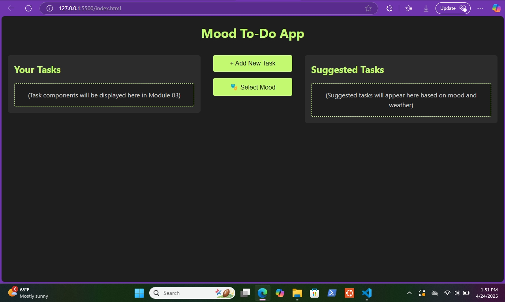

# Mood-Based To-Do App (Module 2 - Static HTML/CSS)

## 🧠 Overview

This is the static front-end layout for a **Mood-Based To-Do App**, built as part of the Metana Fullstack Bootcamp Module 2 assignment.

The app is designed to:
- Help users manage tasks visually and efficiently.
- Provide mood-based task suggestions (coming in later modules).
- Look great across devices using responsive design.

All components are currently static and will be integrated with JavaScript logic in Module 03.

---

## 🎯 Features

- ✅ Clean, modern UI with **charcoal and lime green** color theme.
- ✅ Responsive design (mobile, tablet, desktop).
- ✅ Reusable components:
  - Task display cards
  - Suggested task layout
  - Mood selector
  - Task creation form
  - Login form
- ✅ Organized folder structure

---

## 📁 Folder Structure

mood-based-todo-app/
├── index.html  
├── README.md  
├── Styles/  
│   ├── index.css  
│   ├── login.css  
│   ├── tasksComponent.css  
│   ├── suggestedTaskComponent.css  
│   ├── taskCreationForm.css  
│   ├── moodSelecter.css  
│   ├── loginForm.css  
├── Assets/  
│   ├── [images, fonts, icons]  
├── Components/  
│   ├── taskComponent.html  
│   ├── suggestedTaskComponent.html  
│   ├── taskCreationForm.html  
│   ├── moodSelecterForm.html  
│   ├── loginForm.html  

---

## 📸 Screenshots

*(Add screenshots of your layout here)*

Example:

---

## 🚀 How to Run

1. Clone this repo:
   git clone https://github.com/DeveloperLily123/mood-based-todo-app.git

2. Open `index.html` in your browser (or use Live Server in VS Code).

---

## 🛠️ Tech Used

- HTML5  
- CSS3 (Flexbox for layout)  
- Responsive Design Principles  

---

## ✅ Status

- ✔️ Static layout complete  
- 🔜 Interactive logic coming in **Module 03**

---

## 👨‍💻 Author

- **Lily** — https://github.com/DeveloperLily123

---

## 📬 Feedback

Feel free to fork this project or open an issue if you have suggestions!
